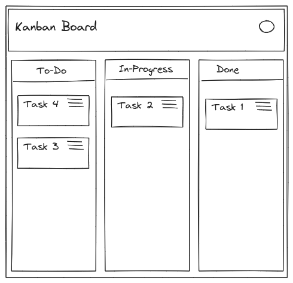

# arc1211 TITLE 

## arc1211 

![[/fragments/labmanuallogo]]

## Overview

In this lab you will learn the fundamentals of <ql-variable key="project_0.startup_script.lab_topic" placeHolder="topic"></ql-variable> using Google Cloud.

If you are new to <ql-variable key="project_0.startup_script.lab_topic" placeHolder="topic"></ql-variable> or looking for an overview of how to get started, you are in the right place. Read on to learn about the specifics of this lab and areas that you will get hands-on practice with.

In this lab learn:

* The use cases for <ql-variable key="project_0.startup_script.lab_topic" placeHolder="topic"></ql-variable>
* How to implement <ql-variable key="project_0.startup_script.lab_topic" placeHolder="topic"></ql-variable>

### Prerequisites

Over the course of this lab the following elements are required:

* <ql-variable key="project_0.startup_script.lab_topic" placeHolder="topic"></ql-variable>

## Task 1. Access the Ticket Application

Open the <ql-variable key="project_0.startup_script.service_url" placeHolder="service url"></ql-variable> to gain access to the lab chat application. 

<ql-infobox>

<strong>Note:</strong> The application link works in both a normal browser tab and an incognito window. An initial loading screen will appear while the lab data is being prepared.
</ql-infobox>

From here you will be able to interact with the application interface during the course of this lab.

<ql-infobox>

<strong>Note:</strong> The above image is the main kanban screen. The screen includes the available tickets reflecting different knowledge domains. The number of tickets displayed will be dependent on the level and persona selected.
</ql-infobox>

The lab mimics a kanban application scenario. Select an active ticket to view the lab specific task. To complete the lab successfully ensure the ticket task is fulfilled per instructions given.

## Congratulations!

In just 30 minutes, you developed an understanding of <ql-variable key="project_0.startup_script.lab_topic" placeHolder="topic"></ql-variable>. You are now ready to take more labs.

## What's next

* Try out other Google Cloud features for yourself. Have a look at our [tutorials](https://cloud.google.com/docs/tutorials).
* Explore more [Google Cloud solutions](https://cloud.google.com/solutions).
* Learn about the <ql-variable key="project_0.startup_script.lab_topic" placeHolder="topic"></ql-variable> suite of products and services

__Manual Last Updated Apr 21, 2025__

__Lab Last Tested Apr 21, 2025__

